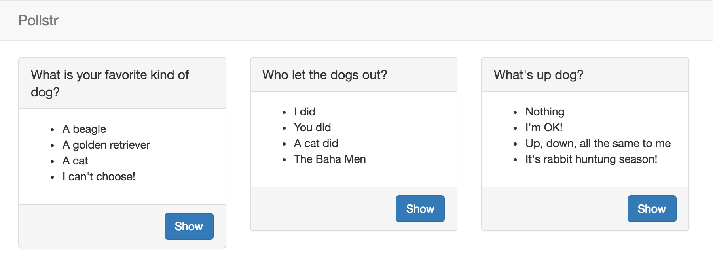

# Two Factor Authentication with Django and Nexmo Verify

I showed my love for two factor authentication last month with a demo application for my "Kittens & Co" business. Interestingly enough not everyone is equally a fan of cats, some of us prefer dogs, some of us prefer other animals, but we all love two factor authentication, right?

## Let's have a little poll

For this tutorial I am going to show you how to add two factor authentication to your Django site using the [Nexmo Verify API](https://www.nexmo.com/products/verify/). For this purpose I have built a little app called [“Pollstr”](https://github.com/nexmo-community/nexmo-django-2fa-demo) – a simple web app for doing polls. I know it's going to be an overnight success because of the missing "e" in the name.



You can download the starting point of the app from Github and run it locally.

```sh
# ensure you have Python and pip installed
git clone https://github.com/nexmo-community/nexmo-django-2fa-demo.git
cd nexmo-django-2fa-demo
pip install -r requirements.txt
python manage.py migrate
python manage.py loaddata fixtures/all.json
python manage.py runserver
```

Then visit [127.0.0.1:8000](http://127.0.0.1:8000) in your browser and try to vote on a poll. You can log in with the username `test` and password `test1234`.

By default the app implements registration and login using built in auth framework but most of this tutorial applies similarly to apps that use other authentication methods. Additionally we added some bootstrap for some prettyfication of our app.

All the code for this starting point can be found on the [before](https://github.com/nexmo-community/nexmo-django-2fa-demo/tree/before) branch on Github. All the code we will be adding below can be found on the [after](https://github.com/nexmo-community/nexmo-django-2fa-demo/tree/after) branch. For your convenience you can see [all the changes between our start and end point](https://github.com/nexmo-community/nexmo-django-2fa-demo/compare/before...after) on Github as well.

## Nexmo Verify for 2FA

[Nexmo Verify](https://www.nexmo.com/products/verify/) is the easiest way to implement phone verification. In most two factor authentication systems you will need to manage your own tokens, token expiry, retries, and SMS sending. Nexmo Verify manages all of this for you and all it requires is just 2 API calls!

To add Nexmo Verify to our app we are going to make the following changes:

* Add a `phone_number` to our user
* Add a `TwoFactorMixin` to our views to ensure the user is logged in and verified
* Send the user a verification code
* Verify the code sent to their number

## Adding a phone number

```sh
# .env
NEXMO_API_KEY=123
NEXMO_API_SECRET=234
```

```python
# polls/views.py
from two_factor.mixins import TwoFactorMixin

class OptionsView(TwoFactorMixin, DetailView):
    ...

class ResultsView(TwoFactorMixin, DetailView):
    ...

class VoteView(TwoFactorMixin,View):
    ...
```

```python
# pollstr/settings.py
INSTALLED_APPS = [
    'polls.apps.PollsConfig',
    'two_factor.apps.TwoFactorConfig',
    'django.contrib.admin',
    ...
]
```

```python
# pollstr/urls.py
urlpatterns = [
    ...
    url(r'^polls/', include('polls.urls')),
    url(r'^2fa/', include('two_factor.urls')),
]
```

```python
# two_factor/mixins.py
from django.contrib.auth.mixins import UserPassesTestMixin
from django.core.urlresolvers import reverse

class TwoFactorMixin(UserPassesTestMixin):
    def test_func(self):
        user = self.request.user
        return (user.is_authenticated and "verified" in self.request.session)

    def get_login_url(self):
        if (self.request.user.is_authenticated()):
            return reverse('two_factor:new')
        else:
            return reverse('login')
```

```python
# two_factor/models.py
from django.db import models
from django.contrib.auth.models import User

class TwoFactor(models.Model):
    number = models.CharField(max_length=16)
    user = models.OneToOneField(User)
```

```html
<!-- two_factor/templates/two_factor/new.html -->




<form class='form-inline' action="" method="post">

  
  <input type="hidden" name="next" value="{{ request.GET.next }}">

  <p>
    To continue we need to verify your phone number.
  </p>

  <div class="form-group">
    <input type="text" name="number" value="{{ object.number }}"
           disabled class='form-control'>
  </div>
  <div class="form-group">
    <input type="submit" name="name" value="Verify" class='btn btn-primary'>
  </div>
</form>


```

```html
<!-- two_factor/templates/two_factor/verify.html -->




<form class='form-inline' action="" method="post">

  
  <input type="hidden" name="next" value="{{request.GET.next}}">

  <p>
    We have sent a code to your number. Please type it in below.
  </p>

  <div class="form-group">
    <input type="text" name="code" class='form-control'>

  </div>
  <div class="form-group">
    <input type="submit" name="name" value="Confirm" class='btn btn-primary'>
  </div>
</form>


```

```python
# two_factor/urls.py
from django.conf.urls import url

from . import views

app_name = 'two_factor'
urlpatterns = [
    url(r'^$', views.NewView.as_view(), name='new'),
    url(r'^create/$', views.CreateView.as_view(), name='create'),
    url(r'^verify/$', views.VerifyView.as_view(), name='verify'),
    url(r'^confirm/$', views.ConfirmView.as_view(), name='confirm'),
]
```

```python
# two_factor/views.py
from django.views.generic import DetailView
from django.contrib.auth.mixins import LoginRequiredMixin

from .models import TwoFactor

class NewView(LoginRequiredMixin, DetailView):
    template_name = 'two_factor/new.html'

    def get_object(self):
        try:
            return self.request.user.twofactor
        except TwoFactor.DoesNotExist:
            return TwoFactor.objects.create(user=self.request.user)
```


```python
# two_factor/views.py
from django.views.generic import DetailView, View
from django.contrib import messages
from django.contrib.auth.mixins import LoginRequiredMixin
from django.http import HttpResponseRedirect
from django.core.urlresolvers import reverse
from django.contrib.auth import logout

import nexmo

from .models import TwoFactor

class CreateView(LoginRequiredMixin, View):
    def post(self, request):
        number = self.find_or_set_number(request)
        response = self.send_verification_request(request, number)

        if (response['status'] == '0'):
            request.session['verification_id'] = response['request_id']
        else:
            logout(request)
            messages.add_message(request, messages.INFO, 'Could not verify your number. Please contact support.')
            return HttpResponseRedirect('/')

        return HttpResponseRedirect(reverse('two_factor:verify')+"?next="+request.POST['next'])

    def find_or_set_number(self, request):
        two_factor = request.user.twofactor

        if (not two_factor.number):
            two_factor.number = request.POST['number']
            two_factor.save()

        return two_factor.number

    def send_verification_request(self, request, number):
        client = nexmo.Client()
        return client.start_verification(number=number, brand='Pollstr')
```

```python
# two_factor/views.py
from django.views.generic import DetailView, View, TemplateView

class VerifyView(LoginRequiredMixin, TemplateView):
    template_name = 'two_factor/verify.html'
```

```python
# two_factor/views.py
class ConfirmView(LoginRequiredMixin, View):
    def post(self, request):
        response = self.check_verification_request(request)

        if (response['status'] == '0'):
            request.session['verified'] = True
            return HttpResponseRedirect(request.POST['next'])
        else:
            messages.add_message(request, messages.INFO, 'Could not verify code. Please try again.')
            return HttpResponseRedirect(reverse('two_factor:verify')+"?next="+request.POST['next'])


    def check_verification_request(self, request):
        return nexmo.Client().check_verification(request.session['verification_id'], code=request.POST['code'])
```
