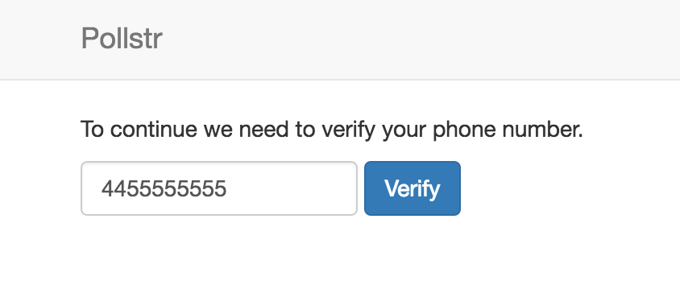
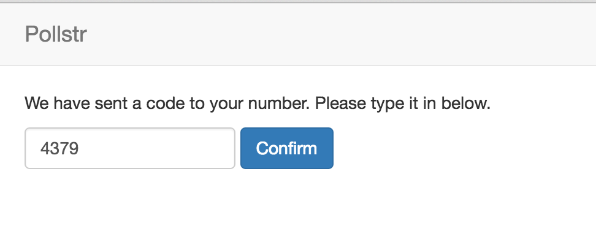
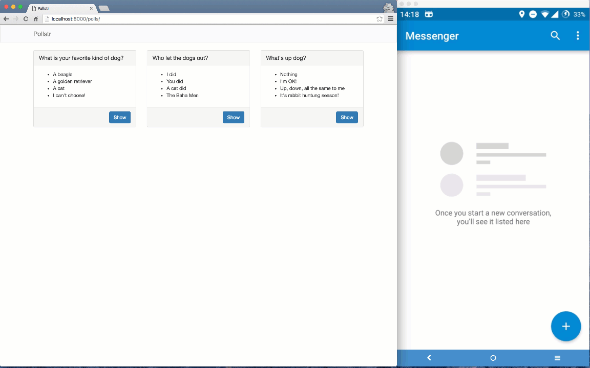

# Two Factor Authentication with Django and Nexmo Verify

I showed my love for two factor authentication last month with a demo application for my ["Kittens & Co" business](https://www.nexmo.com/blog/2016/06/07/two-factor-authentication-2fa-ruby-rails-devise-nexmo-verify/). Interestingly enough not everyone is equally a fan of cats, some of us prefer dogs, some of us prefer other animals, but we all love two factor authentication, right?

## Let's have a little poll

For this tutorial I am going to show you how to add two factor authentication to your Django site using the [Nexmo Verify API](https://www.nexmo.com/products/verify/). For this purpose I have built a little app called [“Pollstr”](https://github.com/nexmo-community/nexmo-django-2fa-demo) – a simple web app for doing polls. I know it's going to be an overnight success because of the missing "e" in the name. I want to add two-factor-authentication to ensure that people are indeed who they say they are, and to prevent spam on my polls.


You can download the starting point of the app from [Github](https://github.com/nexmo-community/nexmo-django-2fa-demo) and run it locally.

```sh
# ensure you have Python and pip installed
git clone https://github.com/nexmo-community/nexmo-django-2fa-demo.git
cd nexmo-django-2fa-demo
pip install -r requirements.txt
python manage.py migrate
python manage.py loaddata fixtures/all.json
python manage.py runserver
```

Then visit [127.0.0.1:8000](http://127.0.0.1:8000) in your browser and try to vote on a poll. You can log in with these credentials:

* **username:** `test`
* **password:** `test1234`

By default the app implements registration and login using Django's built in auth framework but most of this tutorial applies similarly to apps that use other authentication methods. Additionally we added some bootstrap for some prettyfication of our app.

All the code for this starting point can be found on the [before](https://github.com/nexmo-community/nexmo-django-2fa-demo/tree/before) branch on Github. All the code we will be adding below can be found on the [after](https://github.com/nexmo-community/nexmo-django-2fa-demo/tree/after) branch. For your convenience you can see [all the changes between our start and end point](https://github.com/nexmo-community/nexmo-django-2fa-demo/compare/before...after) on Github as well.

## Nexmo Verify for 2FA

[Nexmo Verify](https://www.nexmo.com/products/verify/) is no-hassle and secure way way to implement phone verification in just 2 API calls! In most two factor authentication systems you will need to manage your own tokens, token expiry, retries, and SMS sending. Nexmo Verify manages all of this for you.

To add Nexmo Verify to our app we are going to make the following changes:

* Add a `phone_number` to our user
* Add a `TwoFactorMixin` to our views to ensure the user is logged in and verified
* Record a new phone number for new users
* Send the user a verification code
* Verify the code sent to their number

## Adding a phone number

The default user model in Django does not have a phone number, so we're going to have to add one ourselves. There's a few ways we could do this but in this case we're going keep all our new code contained to a new `two_factor` app.

```sh
python manage.py startapp two_factor
```

This will generate a lot of new files in the `/two_factor` folder. Lets open up the `/two_factor/models.py` and add a new model that has a One-to-One relation with our user.

```python
# two_factor/models.py
...
from django.contrib.auth.models import User

class TwoFactor(models.Model):
    number = models.CharField(max_length=16)
    user = models.OneToOneField(User)
```

Next up we will want to generate the migrations for this model, but to do so we first need to make sure to add `two_factor.apps.TwoFactorConfig` to our `INSTALLED_APPS`.

```python
# pollstr/settings.py
INSTALLED_APPS = [
    'polls.apps.PollsConfig',
    'two_factor.apps.TwoFactorConfig',
    'django.contrib.admin',
    ...
]
```

With this in place we can generate our migrations and migrate our database:

```sh
> python manage.py makemigrations two_factor
Migrations for 'two_factor':
 0001_initial.py:
   - Create model TwoFactor
> python manage.py migrate
Operations to perform:
  Apply all migrations: sessions, admin, two_factor, polls, auth, contenttypes
Running migrations:
  Rendering model states... DONE
  ...
```

## Adding a TwoFactorMixin

Our Django app uses [class-based views](https://docs.djangoproject.com/en/1.9/topics/class-based-views/) which allow us to use custom "mixins" to add our own behaviour every view. Currently we use the `LoginRequiredMixin` to ensure we are logged in before we can vote on polls.

```python
# polls/views.yml
class OptionsView(LoginRequiredMixin, DetailView):
    ...
```

We are going to implement a new `TwoFactorMixin` to add a TwoFactor layer to this check. Let's start by changing our views to use this new mixin, even though we haven't written it yet.

```python
# polls/views.py
from two_factor.mixins import TwoFactorMixin

class OptionsView(TwoFactorMixin, DetailView):
    ...

class ResultsView(TwoFactorMixin, DetailView):
    ...

class VoteView(TwoFactorMixin,View):
    ...
```

Now let's add the mixin in to our `two_factor` app:

```python
# two_factor/mixins.py
from django.contrib.auth.mixins import UserPassesTestMixin
from django.core.urlresolvers import reverse

class TwoFactorMixin(UserPassesTestMixin):
    def test_func(self):
        user = self.request.user
        return (user.is_authenticated and "verified" in self.request.session)

    def get_login_url(self):
        if (self.request.user.is_authenticated()):
            return reverse('two_factor:new')
        else:
            return reverse('login')
```

What we have done here is to create a new mixin that itself uses the `UserPassesTestMixin`. This mixin then automatically calls the `test_func` function where we check that the user is both logged in and that this session has been verified. We do the latter by simply checking if the key `verified` has been set in the session. By using the session like this someone can be logged in on multiple machines while still requiring verification for each of them.

The `get_login` function provides the `UserPassesTestMixin` with a route to redirect the user to if the test fails. In this case we have 2 scenarions, one where the user is not logged in at all, and one where they are logged in but not verified.

If you'd run your server at this point it would fail because, well, we haven't implemented any of the routes or views yet to redirect the user to. Let's do this next.

## Selecting a phone number



When the user needs to be verified they get redirected to `two_factor:new` where we will ask them to either set, or confirm the phone number that we will send a code to.

```python
# two_factor/urls.py
from django.conf.urls import url

from . import views

app_name = 'two_factor'
urlpatterns = [
    url(r'^$', views.NewView.as_view(), name='new'),
    url(r'^create/$', views.CreateView.as_view(), name='create'),
    url(r'^verify/$', views.VerifyView.as_view(), name='verify'),
]
```

We also added the URLS for our next steps as well. Next we do need to make sure to import these URLs into our main app as well.

```python
# pollstr/urls.py
urlpatterns = [
    ...
    url(r'^polls/', include('polls.urls')),
    url(r'^2fa/', include('two_factor.urls')),
]
```

When the app redirect to `/2fa/` it will try to render the `NewView` view. This view is going to make the `TwoFactor` model available to the template, but we have to catch the obvious exception when the user does not have a `TwoFactor` object yet, and initialize one instead.

```python
# two_factor/views.py
from django.views.generic import DetailView
from django.contrib.auth.mixins import LoginRequiredMixin

from .models import TwoFactor

class NewView(LoginRequiredMixin, DetailView):
    template_name = 'two_factor/new.html'

    def get_object(self):
        try:
            return self.request.user.twofactor
        except TwoFactor.DoesNotExist:
            return TwoFactor.objects.create(user=self.request.user)
```

We try to return the `user.twofactor` record but if it not exists we initialize one instead and return that.

The view renders the `two_factor/new.html` template which will allow the user to either fill in their phone number, or shows their already provided number in a disabled field. We will ignore this number later on if it was already set, but it makes for a nice hint to the user what number the code will be sent to.

```html
<!-- two_factor/templates/two_factor/new.html -->




<form class='form-inline' action="" method="post">

  
  <input type="hidden" name="next" value="{{ request.GET.next }}">

  <p>
    To continue we need to verify your phone number.
  </p>

  <div class="form-group">
    <input type="text" name="number" value="{{ object.number }}"
           disabled class='form-control'>
  </div>
  <div class="form-group">
    <input type="submit" name="name" value="Verify" class='btn btn-primary'>
  </div>
</form>


```

Ignoring the Bootstrap overhead our form is a basic form with a few fields:

* The `number` to submit a code to
* The `next` page to redirect to after we're done with verifying, this is a built in Django feature so let's play nice with this.

When the form submits to `/2fa/create` we will need to actually send the code to the user with Nexmo.

## Using Nexmo Verify

[Nexmo Verify](https://www.nexmo.com/products/verify/) is very easy to use and essentially comes down to 2 API calls. The first one sends the verification code to the user's phone number. In our case this will happen in the `CreateView` when the form is submitted.

To send the code we will need the [`nexmo`](https://github.com/Nexmo/nexmo-python) Python library. We already added this to your `requirements.txt` together with the [`django-dotenv`](https://github.com/jpadilla/django-dotenv) library which will allow us to load our credentials from a `.env` file. If you have a different preferred way of managing your app dependencies you can install them with pip directly.

```sh
pip install nexmo
pip install django-dotenv
```

The `nexmo` libary can either be instantiated with an API key and secret, or by setting the some environment variables. You can get your [Nexmo API key and secret](https://dashboard.nexmo.com/settings) from the developer [dashboard](https://dashboard.nexmo.com/settings).

```sh
# .env
NEXMO_API_KEY=123
NEXMO_API_SECRET=234
```

With these environment variables set we now no longer need to initialize our Nexmo client and can use it directly as follows.

```python
# two_factor/views.py
from django.views.generic import DetailView, View
from django.contrib import messages
from django.contrib.auth.mixins import LoginRequiredMixin
from django.http import HttpResponseRedirect
from django.core.urlresolvers import reverse
from django.contrib.auth import logout

import nexmo

from .models import TwoFactor

class CreateView(LoginRequiredMixin, View):
    def post(self, request):
        number = self.find_or_set_number(request)
        response = self.send_verification_request(request, number)

        if (response['status'] == '0'):
            request.session['verification_id'] = response['request_id']
            return HttpResponseRedirect(reverse('two_factor:verify')+"?next="+request.POST['next'])
        else:
            logout(request)
            messages.add_message(request, messages.INFO, 'Could not verify your number. Please contact support.')
            return HttpResponseRedirect('/')


    def find_or_set_number(self, request):
        two_factor = request.user.twofactor

        if (not two_factor.number):
            two_factor.number = request.POST['number']
            two_factor.save()

        return two_factor.number

    def send_verification_request(self, request, number):
        client = nexmo.Client()
        return client.start_verification(number=number, brand='Pollstr')
```

The code here does a few things. First off it uses `find_or_set_number` to check if the user already has a phone number set, and **only if not** sets saves the number they submitted.

It then uses `nexmo.Client().start_verification` to start the verification process. We pass in 2 parameters here: the `number` of the user and a user friendly `brand` name that will appear in the text message we send.

Next we check if the `status` of our API call is `0` and if it is we store the `request_id` for this verification attempt in the session. We do this as we will need this same `id` later again to confirm the code the user received.

Finally we redirect the user to our `VerifyView` which is a simple view that renders a form to capture the code.

```python
# two_factor/views.py
from django.views.generic import DetailView, View, TemplateView

class VerifyView(LoginRequiredMixin, TemplateView):
    template_name = 'two_factor/verify.html'
```

And the corresponding template. As you can see we're still passing the `next` value along so we can redirect back to the right poll in the end.

```html
<!-- two_factor/templates/two_factor/verify.html -->




<form class='form-inline' action="" method="post">

  
  <input type="hidden" name="next" value="{{request.GET.next}}">

  <p>
    We have sent a code to your number. Please type it in below.
  </p>

  <div class="form-group">
    <input type="text" name="code" class='form-control'>

  </div>
  <div class="form-group">
    <input type="submit" name="name" value="Confirm" class='btn btn-primary'>
  </div>
</form>


```

## Verifying the user's code



The last step in this tutorial is to confirm the code the user provides. Let's first add the route for this page.

```python
# two_factor/urls.py
urlpatterns = [
    ...
    url(r'^confirm/$', views.ConfirmView.as_view(), name='confirm'),
]
```

In the previous step the user was presented with a form with a `code` field. When they submit this to the `two_factor:verify` URL we will need to call the `nexmo` library again with the code and the `request_id` we stored in the session earlier.

```python
# two_factor/views.py
class ConfirmView(LoginRequiredMixin, View):
    def post(self, request):
        response = self.check_verification_request(request)

        if (response['status'] == '0'):
            request.session['verified'] = True
            return HttpResponseRedirect(request.POST['next'])
        else:
            messages.add_message(request, messages.INFO, 'Could not verify code. Please try again.')
            return HttpResponseRedirect(reverse('two_factor:verify')+"?next="+request.POST['next'])


    def check_verification_request(self, request):
        return nexmo.Client().check_verification(request.session['verification_id'], code=request.POST['code'])
```

We use the `nexmo.Client().check_verification` function to check the code is valid for the `request_id`. If it was succesful the status code will be `0` and we mark the session as verified. When we redirect the user to the page they started off on the `TwoFactorMixin` will now no longer redirect the user away and instead will keep them on.



## Next steps

There are many more options in the [Nexmo Verify API](https://www.nexmo.com/products/verify/) than we’ve covered here. The code we showed here is pretty simple and there's many different ways this user experience could be implemented. The Nexmo Verify system is extremely resilient, as it falls back to phone calls if needed, expires tokens without you having to do anything, prevents reuse of tokens, and logs verification times.

The Nexmo Python library is very agnostic as to how it’s used which means you could implement things very differently than I did here. I’d love to know what you’d add next? Please drop me a tweet (I’m [@cbetta](https://twitter.com/cbetta)) with thoughts and ideas.
